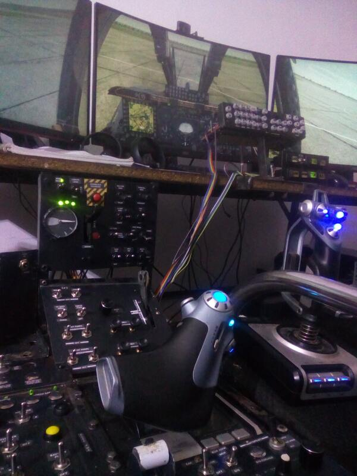
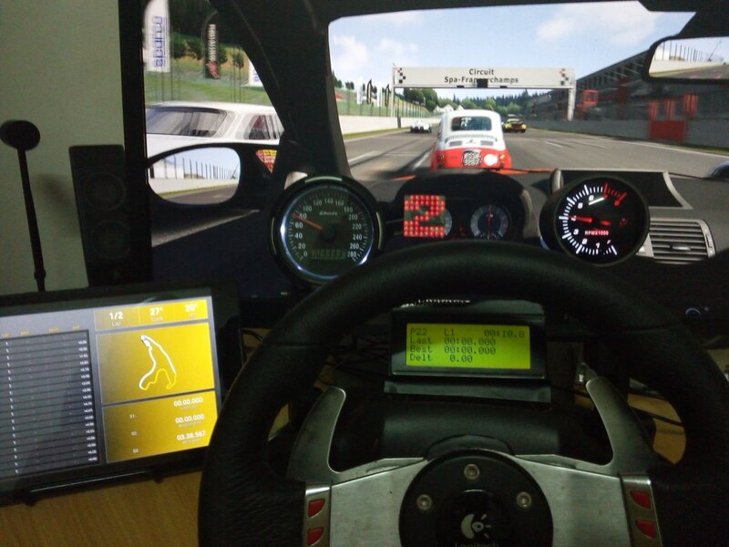

# DIY Cockpit : Simulateurs A-10C Warthog et Assetto Corsa

Bienvenue sur le dépôt GitHub de mes projets de cockpit dédié aux simulateurs **A-10C Warthog** (DCS World) et **Assetto Corsa**, simulation automobile plus généralement. Fait sans impression 3D, avec les moyens du bord.   

Un autre projet dédié à ETS2 est disponible sur [ce dépôt](https://github.com/solofo-ralitera/GMTHub)

Le cockpit/simpit intègre des commandes physiques, des écrans, et des interfaces pour reproduire les environnements de ces simulateurs.

## Les cockpit / simpit

### **A-10C Warthog** dans *DCS World* : Un simulateur de vol militaire réaliste centré sur l'avion d'attaque A-10C.

### **Assetto Corsa** : Un simulateur de course automobile offrant une expérience de conduite précise et immersive.

