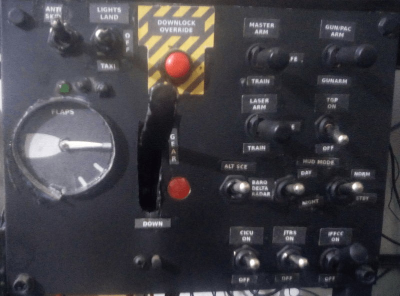

# AHCP et Landing Gear and Flap Control Panel

## Description

Ce module intègre deux panneaux essentiels du cockpit A-10C :  
- **AHCP** (Armament HUD Control Panel)  
- **Landing Gear and Flap Control Panel** (Panneau de contrôle des trains d'atterrissage et des volets)

## Fonctionnement

- Utilise un **Arduino Nano** connecté au bus **I2C** du **master-controller**.  
- Un **servo SG90** est positionné derrière l'indicateur de volets pour en simuler le mouvement.  
- Les **LEDs** sont contrôlées par le module radio, via un circuit intégré **MAX7219**.

---

### Détails techniques

1. **Arduino Nano** :  
   - Gère la communication avec le **master-controller** via le bus **I2C**.  
   - Contrôle les entrées/sorties pour les boutons, interrupteurs et indicateurs.

2. **Servo SG90** :  
   - Simule le mouvement de l'indicateur de position des volets.  
   - Positionné mécaniquement derrière le panneau pour un réalisme accru.

3. **Module MAX7219** :  
   - Utilisé pour piloter les LEDs du panneau.  
   - Permet un contrôle efficace et simplifié des affichages lumineux.

---

## Points clés

- **Intégration I2C** : Communication fluide avec le master-controller.  
- **Réalisme accru** : Grâce au servo SG90 pour l'indicateur de volets.  
- **Contrôle des LEDs** : Gestion optimisée via le MAX7219.

## Overview

