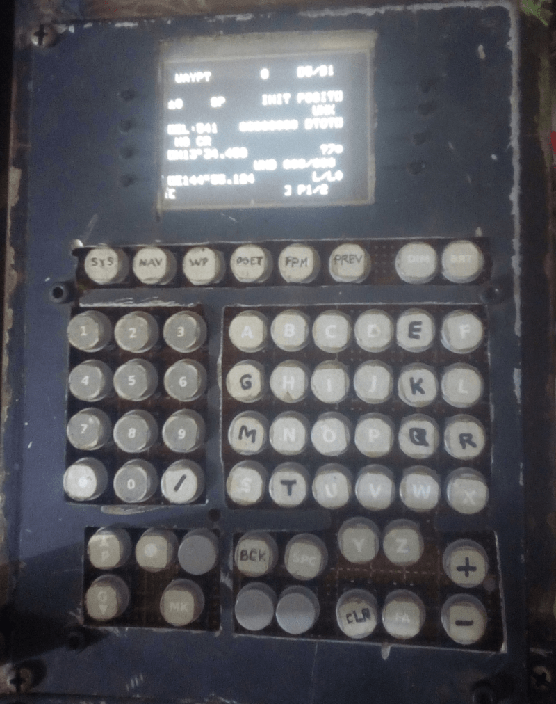

# Écran du Control Display Unit (CDU)

## Description

Ce module reproduit l'écran du **Control Display Unit (CDU)** du cockpit A-10C.  
Il affiche les informations de navigation, de communication et de gestion des systèmes de l'avion.

## Fonctionnement

- Utilise un **Arduino Uno** connecté directement au PC.  
- L'écran est un **2.8" TFT** avec une résolution de **320x240 pixels**, piloté par un contrôleur **HX8347D**.  
- La bibliothèque Arduino **MCUFRIEND_kbv** est utilisée pour contrôler l'écran.  
- **DCS-BIOS** fournit les données à afficher en temps réel.

---

### Détails techniques

1. **Arduino Uno** :  
   - Gère la communication entre le PC et l'écran TFT.  
   - Reçoit les données de **DCS-BIOS** et les transmet à l'écran.

2. **Écran TFT 2.8"** :  
   - Résolution : **320x240 pixels**.  
   - Contrôleur : **HX8347D**.  
   - Affichage clair et précis des informations du CDU.

3. **Bibliothèque MCUFRIEND_kbv** :  
   - Simplifie le contrôle de l'écran TFT.  
   - Permet une intégration facile avec l'Arduino Uno.

4. **DCS-BIOS** :  
   - Fournit les données en temps réel du simulateur **DCS World**.  
   - Assure la synchronisation entre le simulateur et l'affichage sur l'écran.

---

## Points clés

- **Connexion directe au PC** : Simplifie l'intégration avec **DCS World**.  
- **Affichage haute résolution** : Grâce à l'écran TFT 320x240.  
- **Contrôle optimisé** : Utilisation de la bibliothèque **MCUFRIEND_kbv**.  
- **Données en temps réel** : Fournies par **DCS-BIOS** pour un réalisme accru.

## Overview
