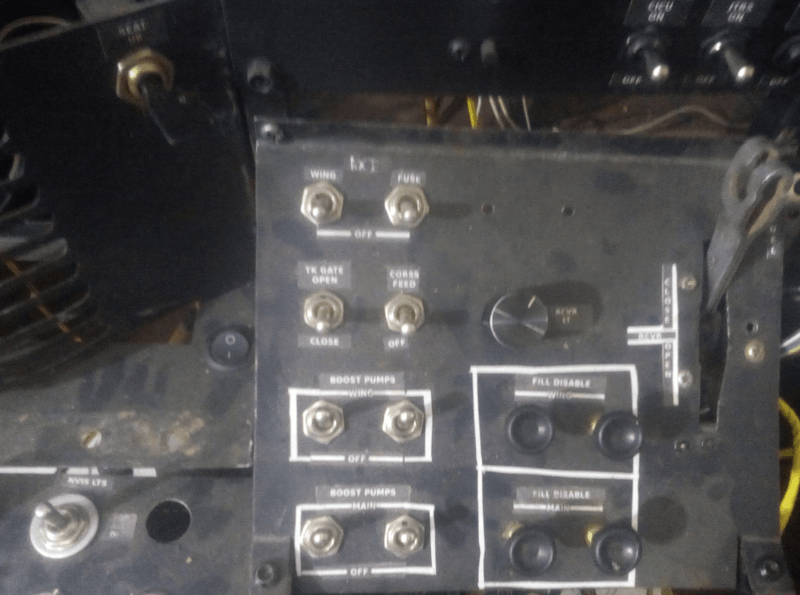

# Fuel System Control Panel et Emergency Brake System

## Description

Ce module intègre deux systèmes essentiels du cockpit A-10C :  
- **Fuel System Control Panel** (Panneau de contrôle du système de carburant)  
- **Emergency Brake System** (Système de freinage d'urgence)

## Fonctionnement

- Utilise un **Arduino Nano** connecté au bus **I2C** du **master-controller**.  
- Gère les entrées/sorties pour les commandes et les indicateurs liés au carburant et au freinage d'urgence.

---

### Détails techniques

1. **Arduino Nano** :  
   - Gère la communication avec le **master-controller** via le bus **I2C**.  
   - Contrôle les interrupteurs et boutons des deux systèmes.

2. **Emergency Brake System** :  
   - Contrôle le freinage d'urgence de l'avion.  
   - Inclut des indicateurs pour le statut du système et les alarmes.

---

## Points clés

- **Intégration I2C** : Communication fluide avec le master-controller.  
- **Gestion centralisée** : Un seul Arduino Nano pour deux systèmes.  
- **Réalisme accru** : Reproduction des commandes et indicateurs du cockpit A-10C.

## Overview

