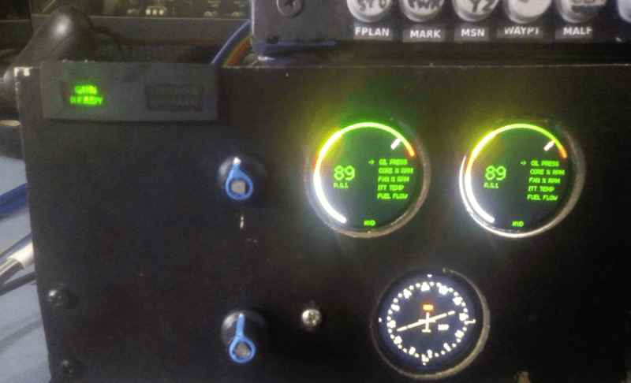

# Horizontal Situation Indicator (HSI) - Engine Monitoring Instruments - Gun and Nose Wheel Steering (NWS) Lights

## Description

Ce module intègre trois systèmes essentiels du cockpit A-10C :  
- **Horizontal Situation Indicator (HSI)** (Indicateur de situation horizontale)  
- **Engine Monitoring Instruments** (Instruments de surveillance des moteurs)  
- **Gun and Nose Wheel Steering (NWS) Lights** (Lumières du canon et du braquage de la roue avant)

## Fonctionnement

- Utilise un **ESP32** connecté directement au PC.  
- **DCS-BIOS** fournit les données à afficher en temps réel.  
- Trois afficheurs ronds **UN128 240x240 RVB** sont utilisés, pilotés par un contrôleur **GC9A01**.

---

### Détails techniques

1. **ESP32** :  
   - Gère la communication avec le PC et les afficheurs.  
   - Reçoit les données de **DCS-BIOS** et les transmet aux afficheurs.

2. **Afficheurs UN128 240x240 RVB** :  
   - Résolution : **240x240 pixels**.  
   - Contrôleur : **GC9A01**.  
   - Affichage clair et précis des informations.

3. **DCS-BIOS** :  
   - Fournit les données en temps réel du simulateur **DCS World**.  
   - Assure la synchronisation entre le simulateur et l'affichage.

---

## Fonctionnalités du HSI (1 afficheur)

- **Power OFF Flag** (Indicateur de mise hors tension)  
- **Compass Card** (Cadran du compas)  
- **Aircraft Symbol** (Symbole de l'avion)  
- **Lubber Line** (Ligne de référence)  
- **Bearing Pointer 2** (Pointeur de relèvement 2)  
- **Bearing Pointer 1** (Pointeur de relèvement 1)  
- **Bearing Validity Flag** (Indicateur de validité du relèvement)  
- **Course Set Knob** (Bouton de réglage de cap, utilise un encodeur)  
- **Course Selector Window** (Fenêtre de sélection de cap)  
- **Course Arrow** (Flèche de cap)  
- **Course Deviation Indicator (CDI)** (Indicateur de déviation de cap)

---

## Fonctionnalités des Engine Monitoring Instruments (2 afficheurs)

Un afficheur est dédié à chaque moteur (gauche et droit). Un encodeur permet de changer d'instrument affiché :

- **Engine Oil Pressure Indicators** (Indicateurs de pression d'huile des moteurs)  
- **Engine Core Speed Indicators** (Indicateurs de vitesse du cœur des moteurs)  
- **Engine Fan Speed Indicators** (Indicateurs de vitesse du ventilateur des moteurs)  
- **Engine Interstage Turbine Temperature (ITT) Indicators** (Indicateurs de température des turbines)  
- **Engine Fuel Flow Indicators** (Indicateurs de débit de carburant)  
- **Hydraulic System Pressure** (Pression du système hydraulique)

---

## Points clés

- **Connexion directe au PC** : Simplifie l'intégration avec **DCS World**.  
- **Affichage** : Grâce aux écrans UN128 240x240 RVB.  
- **Contrôle** : Utilisation du contrôleur **GC9A01**.  
- **Données en temps réel** : Fournies par **DCS-BIOS** pour un réalisme accru.

## Overview

