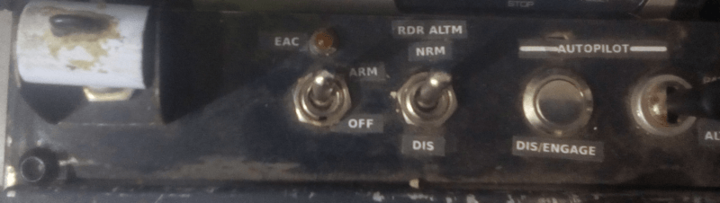
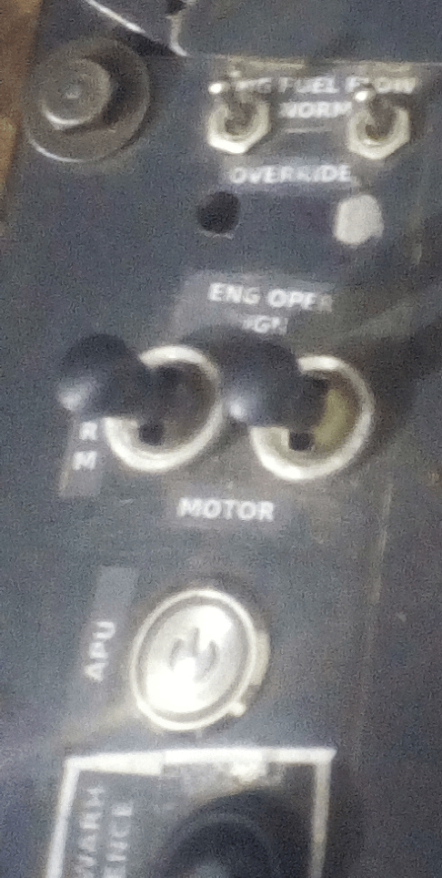

# LASTE Control Panel et Throttles Panel

## Description

Ce module intègre deux panneaux essentiels du cockpit A-10C :  
- **LASTE Control Panel** (Panneau de contrôle LASTE)  
- **Throttles Panel** (Panneau des manettes des gaz)

## Fonctionnement

- Utilise un **Arduino Nano** connecté au bus **I2C** du **master-controller**.  
- Gère les entrées/sorties pour les commandes et les indicateurs liés aux systèmes LASTE et aux manettes des gaz.

---

### Détails techniques

1. **Arduino Nano** :  
   - Gère la communication avec le **master-controller** via le bus **I2C**.  
   - Contrôle les interrupteurs, boutons et indicateurs des deux panneaux.

2. **LASTE Control Panel** :  
   - Permet de gérer les systèmes **Low Altitude Safety and Targeting Enhancement (LASTE)**.  
   - Inclut des commandes pour le pilote automatique, le système de navigation et les aides à la visée.

3. **Throttles Panel** :  
   - Contrôle les manettes des gaz pour les deux moteurs de l'A-10C.  
   - Intègre des interrupteurs pour les systèmes auxiliaires liés aux moteurs.

---

## Points clés

- **Intégration I2C** : Communication fluide avec le master-controller.  
- **Gestion centralisée** : Un seul Arduino Nano pour deux panneaux.  
- **Réalisme accru** : Reproduction des commandes et indicateurs du cockpit A-10C.

## Overview
### LASTE Control panel

### Throttles Panel

