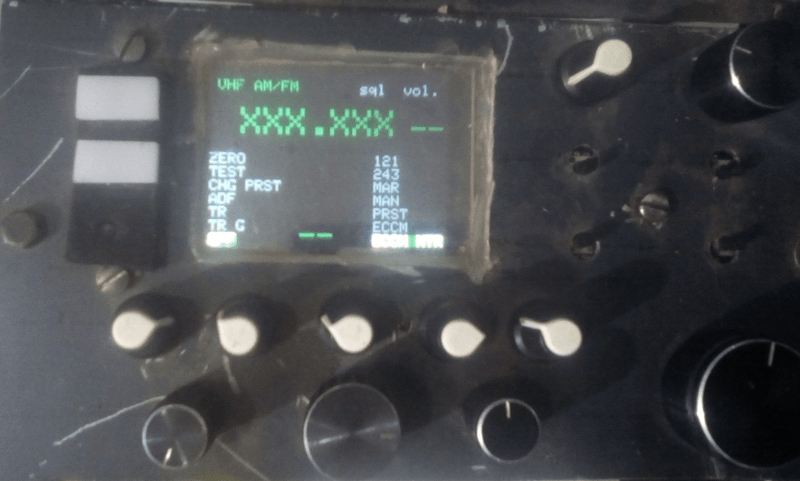
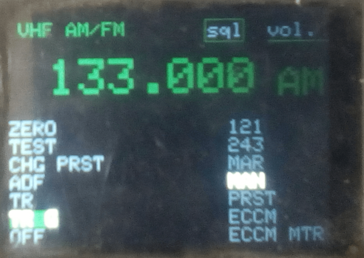
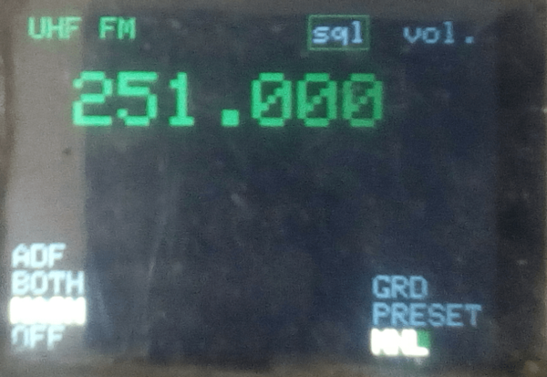
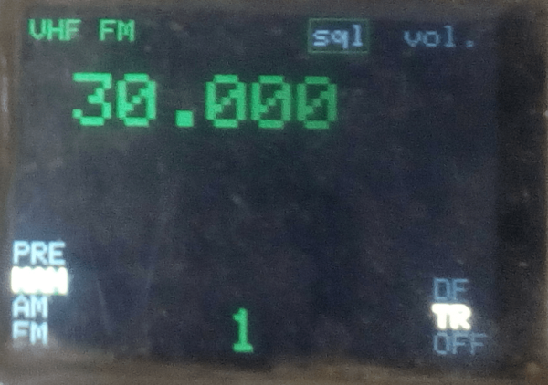
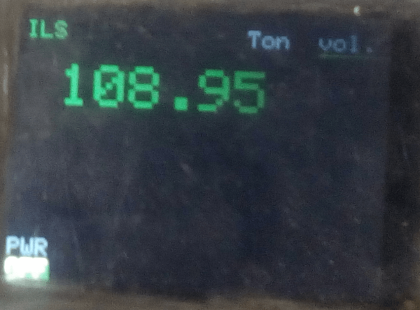
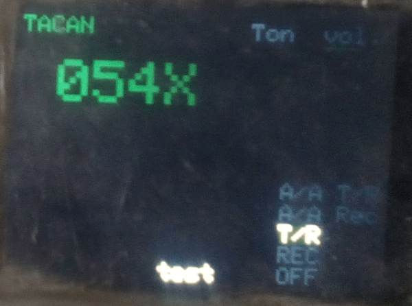
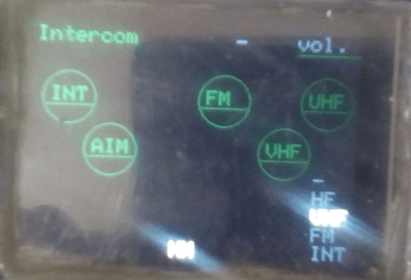
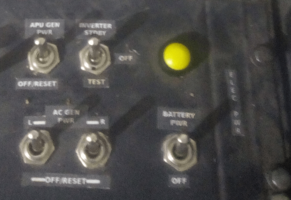

# RADIOs

## Description

Ce module regroupe le contrôle des systèmes de communication et des sous-systèmes associés du cockpit A-10C :  
- **ARC-210**  
- **UHF**  
- **VHF AM/FM**  
- **ILS**  
- **TACAN**  
- **Intercom**  
- **Sous-systèmes** :  
    - Consommation de carburant (**Fuel Consumption**)  
    - Lumières de contrôle (**LEDs Control**), utilisant un circuit intégré **MAX7219**  
    - Commutateurs spécifiques aux versions **A-10C** et **A-10C II**  
    - **Night Vision Goggles (NVG)**  

Le **Electrical Power Panel** est également connecté à ce module.

## Fonctionnement

- Utilise un **Arduino Mega** connecté directement au PC.  
- L'afficheur est un **2.8" TFT 320x240**, piloté par un contrôleur **HX8347D**.  
- La bibliothèque Arduino **MCUFRIEND_kbv** est utilisée pour contrôler l'afficheur.  
- **[DCS-BIOS](https://github.com/DCS-Skunkworks/dcs-bios)** fournit les données à afficher et les commandes à exécuter.  

---

### Détails techniques

1. **Arduino Mega** :  
   - Gère la communication avec le PC et les différents systèmes.  
   - Reçoit les données de **DCS-BIOS** et les transmet à l'afficheur et aux autres composants.

2. **Afficheur TFT 2.8" 320x240** :  
   - Résolution : **320x240 pixels**.  
   - Contrôleur : **HX8347D**.  
   - Affichage clair et précis des informations.

3. **Bibliothèque MCUFRIEND_kbv** :  
   - Simplifie le contrôle de l'afficheur TFT.  
   - Permet une intégration facile avec l'Arduino Mega.

4. **DCS-BIOS** :  
   - Fournit les données en temps réel du simulateur **DCS World**.  
   - Assure la synchronisation entre le simulateur et l'affichage.

5. **Contrôle des LEDs** :  
   - Utilise un circuit intégré **MAX7219** capable de gérer jusqu'à **64 LEDs**.  
   - Tous les voyants du panneau sont gérés par ce module, à l'exception du **Caution Light Panel** qui possède son propre circuit intégré.

---

## Points clés

- **Connexion directe au PC** : Simplifie l'intégration avec **DCS World**.  
- **Affichage** : 'écran TFT 320x240.  
- **Contrôle optimisé** : Utilisation de la bibliothèque **MCUFRIEND_kbv**.  
- **Gestion centralisée** : Un seul module pour les radios, l'ILS, le TACAN, l'intercom et les sous-systèmes.  
- **Réalisme** : Reproduction des commandes et indicateurs du cockpit A-10C.

### Overview

### Radio ARC-210

### UHF Fm

### VHF

### ILS

### TACAN

### Intercom

### Electrical Power Panel

