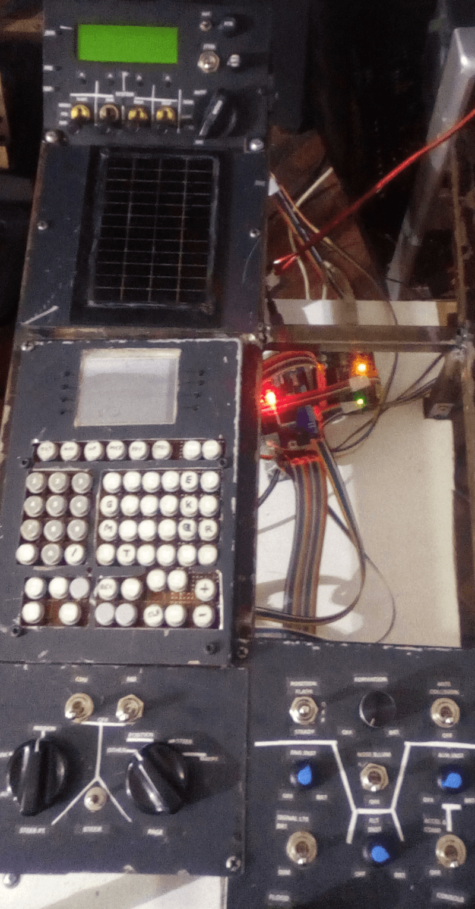
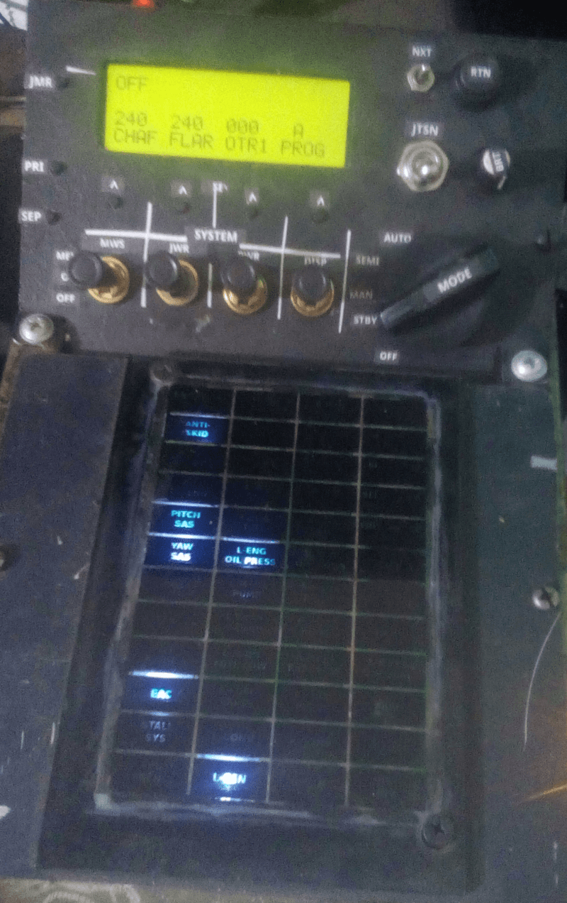

# Right Console

## Description

Ce module regroupe le contrôle des systèmes situés sur la console droite du cockpit A-10C :  
- **Countermeasures Signal Processor (CMSP) Panel**  
- **Caution Light Panel**  
- **Clavier du CDU**  
- **Auxiliary Avionics Panel (AAP)**  
- **Light Control Panel**

## Fonctionnement

- Utilise un **Arduino Mega** connecté directement au PC.  
- **[DCS-BIOS](https://github.com/DCS-Skunkworks/dcs-bios)** fournit les données à afficher et les commandes à exécuter.  
- Le circuit intégré **MAX7219** contrôle les LEDs du **Caution Light Panel**.  
- Une impression sur **plexiglass** sert de façade pour ce panneau.  
- Un écran **LCD 2004** est utilisé pour l'affichage du **Countermeasures Signal Processor (CMSP) Panel**.

---

### Détails techniques

1. **Arduino Mega** :  
   - Gère la communication avec le PC et les différents systèmes.  
   - Reçoit les données de **DCS-BIOS** et les transmet aux composants.

2. **Circuit intégré MAX7219** :  
   - Contrôle les LEDs du **Caution Light Panel**.  
   - Capable de gérer jusqu'à **64 LEDs**.  

3. **Affichage LCD 2004** :  
   - Utilisé pour afficher les informations du **CMSP Panel**.  
   - Résolution : **20 caractères x 4 lignes**.

4. **Plexiglass** :  
   - Utilisé comme façade pour le **Caution Light Panel**.  
   - Permet une diffusion uniforme de la lumière des LEDs.

5. **DCS-BIOS** :  
   - Fournit les données en temps réel du simulateur **DCS World**.  
   - Assure la synchronisation entre le simulateur et l'affichage.

---

## Points clés

- **Connexion directe au PC** : Simplifie l'intégration avec **DCS World**.  
- **Contrôle des LEDs** : Utilisation du circuit intégré **MAX7219** pour une gestion efficace.  
- **Affichage LCD** : Utilisation d'un écran **LCD 2004** pour le **CMSP Panel**.  
- **Réalisme accru** : Reproduction des commandes et indicateurs du cockpit A-10C.  
- **Gestion centralisée** : Un seul module pour plusieurs systèmes de la console droite.

### Overview

### CMSP - Caution Light Panel

