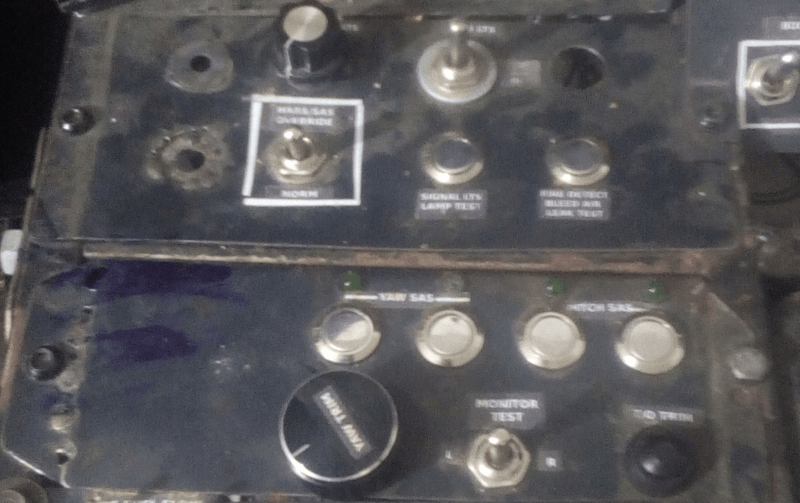

# Stability Augmentation System (SAS) Panel et Auxiliary Lighting Control Panel

## Description

Ce module intègre deux panneaux essentiels du cockpit A-10C :  
- **Stability Augmentation System (SAS) Panel** (Panneau du système d'augmentation de la stabilité)  
- **Auxiliary Lighting Control Panel** (Panneau de contrôle de l'éclairage auxiliaire)

## Fonctionnement

- Utilise un **Arduino Nano** connecté au bus **I2C** du **master-controller**.  
- Gère les entrées/sorties pour les commandes et les indicateurs liés aux systèmes SAS et à l'éclairage auxiliaire.

---

### Détails techniques

1. **Arduino Nano** :  
   - Gère la communication avec le **master-controller** via le bus **I2C**.  
   - Contrôle les interrupteurs, boutons et indicateurs des deux panneaux.

2. **Stability Augmentation System (SAS) Panel** :  
   - Permet de gérer les systèmes d'augmentation de la stabilité de l'avion.  
   - Inclut des interrupteurs pour activer/désactiver les différents modes de stabilisation.

3. **Auxiliary Lighting Control Panel** :  
   - Permet de contrôler l'éclairage auxiliaire du cockpit.  
   - Inclut des commandes pour ajuster l'intensité et la couleur des lumières.

---

## Points clés

- **Intégration I2C** : Communication fluide avec le master-controller.  
- **Gestion centralisée** : Un seul Arduino Nano pour deux panneaux.  
- **Réalisme** : Reproduction des commandes et indicateurs du cockpit A-10C.

## Overview

