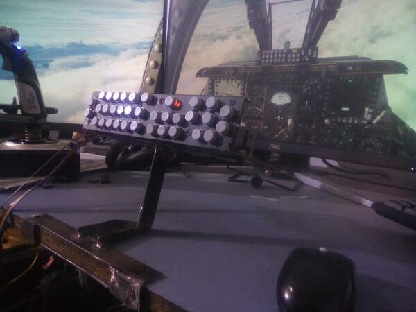
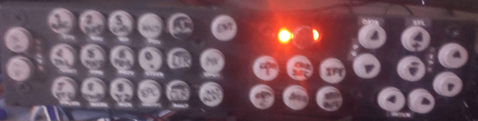
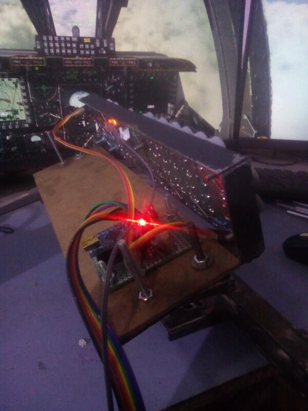
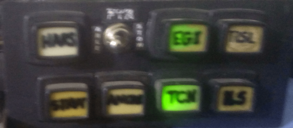

# Up Front Controller (UFC) et Navigation Mode Select Panel (NMSP)

## Description

Ce module intègre deux panneaux essentiels du cockpit A-10C :  
- **Up Front Controller (UFC)** (Contrôleur avant)  
- **Navigation Mode Select Panel (NMSP)** (Panneau de sélection du mode de navigation)

## Fonctionnement

- Utilise un **Arduino Nano** connecté au bus **I2C** du **master-controller**.  
- Les **LEDs** sont contrôlées par le module radio via un circuit intégré **MAX7219** (voir le module radio pour plus de détails).

---

### Détails techniques

1. **Arduino Nano** :  
   - Gère la communication avec le **master-controller** via le bus **I2C**.  
   - Contrôle les interrupteurs, boutons et indicateurs des deux panneaux.

2. **Up Front Controller (UFC)** :  
   - Permet de gérer les entrées de données et les communications.  
   - Inclut des touches numériques, des boutons de fonction et des affichages.

3. **Navigation Mode Select Panel (NMSP)** :  
   - Permet de sélectionner les modes de navigation.  
   - Inclut des interrupteurs et des indicateurs pour les différents modes.

4. **Contrôle des LEDs** :  
   - Utilise un circuit intégré **MAX7219** pour piloter les LEDs.  
   - Géré par le module radio pour une intégration centralisée.

---

## Points clés

- **Intégration I2C** : Communication fluide avec le master-controller.  
- **Contrôle des LEDs** : Utilisation du circuit intégré **MAX7219** pour une gestion efficace.  
- **Gestion centralisée** : Un seul Arduino Nano pour deux panneaux.  
- **Réalisme** : Reproduction des commandes et indicateurs du cockpit A-10C.

## Overview

### UFC Front

### UFC Back

### Navigation Mode Select Panel (NMSP)

